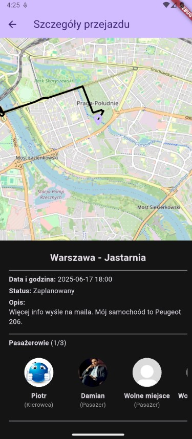
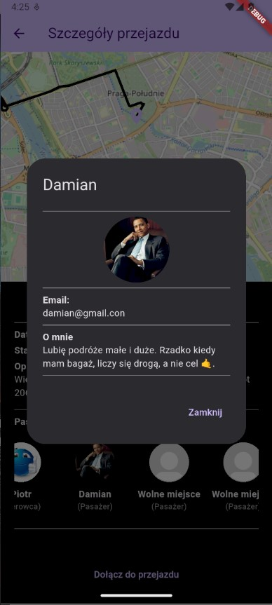

# am_project
<h2>Projekt aplikacji na przedmiot aplikacje mobilne.</h2>

Aplikacja służy do znajdowania pasażerów / kierowców do wspólnych przejazdów. 
Umożliwia zarządzanie przejazdamia i użytkownikami. Posiada motywy (jasny/ciemny), dwie wersje językowe oraz 
umożliwia korzystanie z geolokalizacji.

  
  
  

